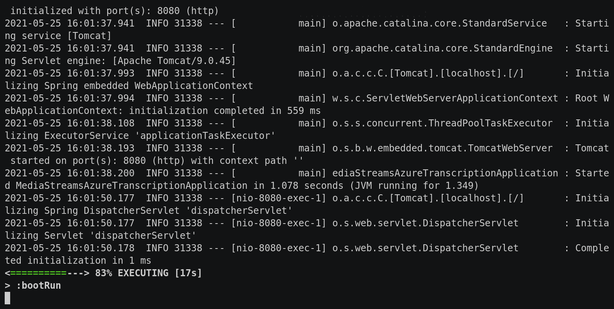

# twilio-media-streams-x-azure-cognitive-services-speech

This repo contains the code which supports my blog post on [using Twilio Media Streams with Azure Cognitive Services for live transcription](https://www.twilio.com/blog/live-transcription-media-streams-azure-cognitive-services-java).

